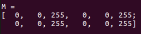

# Mat - The Basic Image Container

## Image storage and processing in OpenCV

We have multiple ways to acquire digital images from the real world: `digital cameras`, `scanners`, `computed tomography`, and `magnetic resonance imaging` to name a few. 
In every case what we (humans) see are images. 
However, when transforming this to our digital devices what we record are numerical values for each of the points of the image.

<div align=center>


</div>

For example in the above image you can see that the `mirror of the car` is nothing more than `a matrix containing all the intensity values of the pixel points`(In php, matrices can be understood as two-dimensional arrays). 
How we get and store the pixels values may vary according to our needs, but in the end all images inside a computer world may be reduced to numerical matrices and other information describing the matrix itself.
OpenCV is a computer vision library whose main focus is to process and manipulate this information.
Therefore, the first thing you need to be familiar with is how OpenCV stores and handles images.

## Mat
The Mat object is a container object used to store image data, that is, the image is converted into a matrix (the matrix can be simply understood as a two-dimensional array) and stored in the Mat.
For example, a picture in RGB format, the first pixel of the picture is white (BRG 255, 255, 255), then its data will be:
```
[ 255, 255, 255, ......;
......
.......................]

```

### Mat copy and assignment

Object assignment in php is assigned using a reference, that is, when you assign a Mat object $a to $c, if you change $c, the value of $a will also be modified.

```php
$a = imread('image path',IMREAD_COLOR);//Read a picture and assign a matrix, $a is a Mat object
$c = $a;
```

All the above objects, in the end, point to the same single data matrix. 

Sometimes you also want to copy a new matrix (not impressed), so PHPOpenCV provides `CV\Mat->clone()` and `CV\Mat->copyTo()` functions.

```php
$f = $a.clone();
$g = null;
$a.copyTo($g);

```

Now modifying $f or $g will not affect the matrix pointed by the Mat header. What you need to remember from all this is that:

- Output image allocation for OpenCV functions is automatic (unless specified otherwise).
- You do not need to think about memory management with OpenCVs C++ interface.
- The assignment operator and the copy constructor only copies the header.
- The underlying matrix of an image may be copied using the `CV\Mat->clone()` and `CV\Mat->copyTo()` functions.

## Storing methods

This is about how you store the pixel values. You can select the color space and the data type used. The color space refers to how we combine color components in order to code a given color. The simplest one is the gray scale where the colors at our disposal are black and white. The combination of these allows us to create many shades of gray.

For colorful ways we have a lot more methods to choose from. Each of them breaks it down to three or four basic components and we can use the combination of these to create the others. The most popular one is RGB, mainly because this is also how our eye builds up colors. Its base colors are red, green and blue. To code the transparency of a color sometimes a fourth element: alpha (A) is added.

There are, however, many other color systems each with their own advantages:

- RGB is the most common as our eyes use something similar, however keep in mind that OpenCV standard display system composes colors using the BGR color space (a switch of the red and blue channel).
- The HSV and HLS decompose colors into their hue, saturation and value/luminance components, which is a more natural way for us to describe colors. You might, for example, dismiss the last component, making your algorithm less sensible to the light conditions of the input image.
- YCrCb is used by the popular JPEG image format.
- CIE L*a*b* is a perceptually uniform color space, which comes handy if you need to measure the distance of a given color to another color.

## Creating a Mat object explicitly

In the Load, Modify, and Save an Image tutorial you have already learned how to write a matrix to an image file by using the `CV\imwrite()` function. 
However, for debugging purposes it's much more convenient to see the actual values. You can do this using the `print()` method of `Mat` object. Be aware that this only works for two dimensional matrices.

Although Mat works really well as an image container, it is also a general matrix class. Therefore, it is possible to create and manipulate multidimensional matrices. You can create a Mat object in multiple ways:

### Mat Constructor

```php
$mat = new Mat(2, 2, CV_8UC3, new Scalar(0,0,255));
echo "M = \r\n";
$mat->print();
```

<div align=center>



</div>


## Expansion, Mat memory management in C++

Mat is basically a class with two data parts: the matrix header (containing information such as the size of the matrix, the method used for storing, at which address is the matrix stored, and so on) and a pointer to the matrix containing the pixel values (taking any dimensionality depending on the method chosen for storing) . The matrix header size is constant, however the size of the matrix itself may vary from image to image and usually is larger by orders of magnitude.

OpenCV is an image processing library. It contains a large collection of image processing functions. To solve a computational challenge, most of the time you will end up using multiple functions of the library. Because of this, passing images to functions is a common practice. We should not forget that we are talking about image processing algorithms, which tend to be quite computational heavy. The last thing we want to do is further decrease the speed of your program by making unnecessary copies of potentially large images.

To tackle this issue OpenCV uses a reference counting system. The idea is that each Mat object has its own header, however the matrix may be shared between two instance of them by having their matrix pointers point to the same address. Moreover, the copy operators will only copy the headers and the pointer to the large matrix, not the data itself.

>PHPOpenCV implements a Mat object based on the C++ interface, so you don't need to worry about Mat's memory problems.

