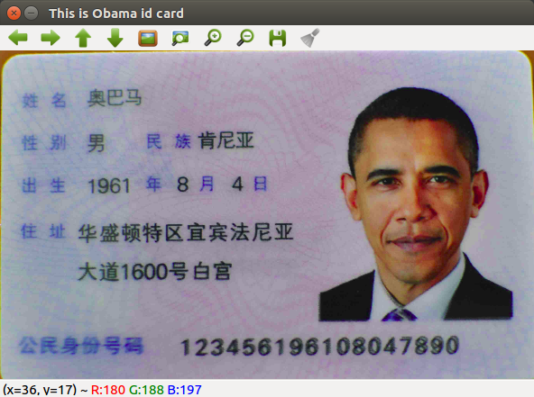

# Quick start

Here we have successfully installed the development needs and understand the structure of PHPOpenCV, now we are developing the first program.


```php
use function CV\{ imread, imshow, waitKey};

$im = imread('Obama.png');//Loading image
imshow('This is Obama id card',$im);//Call the imshow method to display the image
waitKey(0);

```

- The `imread` method is mainly used for users to load images.
- `imshow` is a method for creating GUI display images in PHPOpenCV
- `waitKey` is to let the program wait for user input

结果：



So far, you have successfully run a PHPOpenCV program, which is another big step away from computer vision development.

>If you still don't know what the program is doing, it doesn't matter, you will understand it later.

