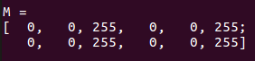

# Mat - 基本图像容器

## OpenCV中的图像存储和处理

我们有多种方式从现实世界中获取数字图像：`数码相机`，`扫描仪`，`计算机断层扫描`和`磁共振成像`等等。
在任何情况下，我们（人类）看到的都是图像。
然而，当将其转换为数字设备时，我们记录的是图像中每个点的数值。

<div align=center>


</div>

例如在上述图像中，您可以看到汽车的`后视镜`只不过是一个`包含所有像素点强度值的矩阵`（在php中，矩阵可以理解为二维数组）。
我们如何获取和存储像素值可能会根据我们的需要而有所不同，
但最终，计算机世界里的所有图像可能会被描述成数字矩阵和其他信息。
OpenCV是一个计算机视觉库，其主要重点是处理和操纵这些信息。因此，您需要熟悉的第一件事是OpenCV如何存储和处理图像。

## Mat
Mat对象是用来存储图像数据的容器对象，也就是说将图像转成矩阵（矩阵可以简单理解为二维数组）存放在Mat中，
例如一张RGB格式的图片，它图片第一个像素点是白色（BRG 255,255,255)的，那么它数数据会是：
```
[ 255, 255, 255, ......;
......
.......................]

```

### Mat复制与赋值

在php中对象赋值是使用引用形式赋值的，也就是当你将一个Mat对象$a赋值给$c，如果对$c修改，则$a的值也会修改。

```php
$a = imread('image path',IMREAD_COLOR);//读取一张图片，并分配矩阵，$a是一个Mat对象
$c = $a;
```

所有上述对象，最后指向相同的单个数据矩阵。

有时你也想复制一个新矩阵（互相不影响），所以PHPOpenCV提供了`CV\Mat->clone()`和`CV\Mat->copyTo()`函数。

```php
$f = $a.clone();
$g = null;
$a.copyTo($g);

```

现在修改$f或$g不会影响Mat头指向的矩阵。所有这一切你需要记住的是：

- OpenCV功能的输出图像分配是自动的（除非另有说明）。
- 您不需要考虑OpenCV C ++界面的内存管理。
- 赋值运算符是同一个矩阵。
- 可以使用`CV\Mat->clone()`和`CV\Mat->copyTo()`函数复制图像的基础矩阵。

## 存储方法
本段是关于如何存储像素值。您可以选择使用颜色空间和数据类型。颜色空间是指我们在对一个给定的颜色进行编码时，如何对该颜色的成分进行组合。
最简单的一个是灰度(gray scale)，我们可以使用的颜色是黑色和白色。这些组合使我们能够创建许多灰色阴影。

对于丰富多彩的图像，我们有许多表示的方法可供选择。将图像每个像素点的表示分解成三到四个基本颜色通道，我们可以使用这些颜色通道来创建图像。
最流行的是RGB，主要是因为这也是我们的眼睛如何建立颜色。其基色为红，绿，蓝。为了可以对颜色的透明度进行编码，有时也会添加第四个元素：A（alpha）。

然而，许多其他的颜色系统也各有各的优势：

- RGB是最常见的，因为我们的眼睛使用类似的东西，但请记住，OpenCV标准显示系统使用BGR颜色空间（红色和蓝色通道的开关）组成颜色。
- HSV和HLS将颜色分解为色调，饱和度和值/亮度分量，这是我们描述颜色的更自然的方式。为了使您的算法对输入图像的光线条件不太敏感，您可能可以选择忽略最后一个组件。
- YCrCb被流行的JPEG图像格式使用。
- CIE L * a * b *是感知统一的颜色空间，如果您需要测量给定颜色与其他颜色的距离，则可方便使用

## 指定创建Mat对象

在加载，修改和保存图像的教程中，您已经学习了如何使用`CV\imwrite()`函数将矩阵写入图像文件。
但是，为了调试目的，为更方便查看Mat实际值。您可以使用`Mat`对象的`print()`方法。请注意，这仅适用于二维矩阵。

虽然Mat可以很好地胜任图像容器的工作，但它也是一个通用的矩阵类。因此，可以创建和操纵多维矩阵。您可以通过多种方式创建Mat对象：

### 构造函数

```php
$mat = new Mat(2, 2, CV_8UC3, new Scalar(0,0,255));
echo "M = \r\n";
$mat->print();
```

<div align=center>



</div>


## 拓展，C++中Mat内存管理

在OpenCV内部，`Mat`是储存图像信息矩阵的容器，OpenCV使用引用计数系统。
这个想法是每个Mat对象都有自己的头，但是通过使它们的矩阵指针指向相同的地址，矩阵可以在它们的两个实例之间共享。
此外，复制操作符只会将头和指针复制到大矩阵，而不是数据本身。

>PHPOpenCV在C++接口的基础上再实现了一个Mat对象，所以你也不需要担心Mat的内存问题。

