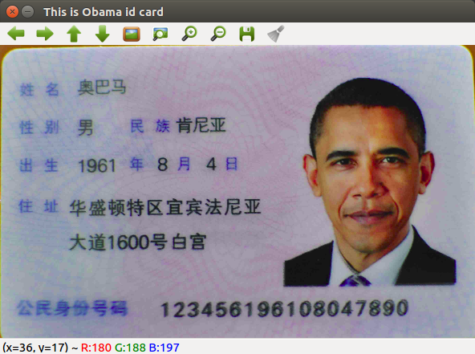

# 快速上手

在这里我们已经成功安装了开发需要的准备和了解了PHPOpenCV的结构了，现在我们来开发第一个程序


```php
use function CV\{ imread, imshow, waitKey};

$im = imread('Obama.png');//加载图片
imshow('This is Obama id card',$im);//调用imshow方法展示图片
waitKey(0);

```

- `imread`方法主要用于用户加载图像
- `imshow`是PHPOpenCV中创建GUI展示图像的方法
- `waitKey`是让程序等待用户输入

结果：



到目前为止，你成功运行一个PHPOpenCV的程序了，距离计算机视觉开发又迈进了一大步。

>如果你还不明这个程序到底做了什么，没关系，后面你便会慢慢理解

